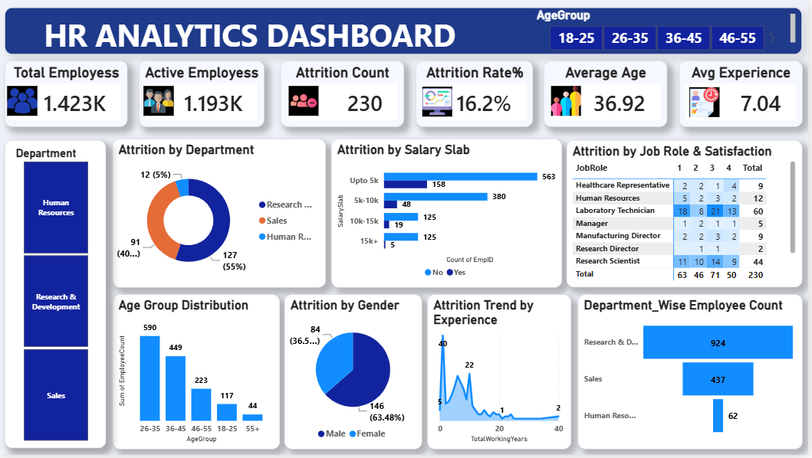

# HR Analytics Dashboard

## Project Overview
This project presents an interactive **HR Analytics Dashboard** built using **Power BI** and **MySQL Workbench**. The dashboard analyzes employee attrition, demographics, salary distribution, and departmental performance.

## Dashboard Preview
Place your screenshot in the repository as `HR_Analytics_Dashboard.png` and use:




## Tools & Technologies
- Power BI
- MySQL Workbench
- SQL
- Microsoft Excel / CSV

## Key KPIs
- Total Employees
- Active Employees
- Attrition Count
- Attrition Rate
- Average Age
- Average Monthly Income

## Dashboard Insights
- Employee Overview
- Attrition Analysis
- Department-wise Analysis
- Gender Distribution
- Age Group Analysis
- Experience Analysis
- Salary Analysis by Job Role

## SQL Analysis
The SQL queries include:
- Employee Count
- Attrition Rate
- Department-wise Analysis
- Average Salary by Department
- Average Salary by Job Role
- Gender Distribution
- Experience Group Analysis
- Age Group Analysis

## Repository Structure
```text
HR-Analytics-Dashboard/
├── README.md
├── HR_Analytics_Dashboard.pbix
├── HR_Analytics_Queries.sql
├── HR_Analytics.csv
└── HR_Analytics_Dashboard.png
```

## Author
**Shaik Hafeefa**

Aspiring Data Analyst

**Skills:** SQL • Power BI • Excel • Data Visualization
